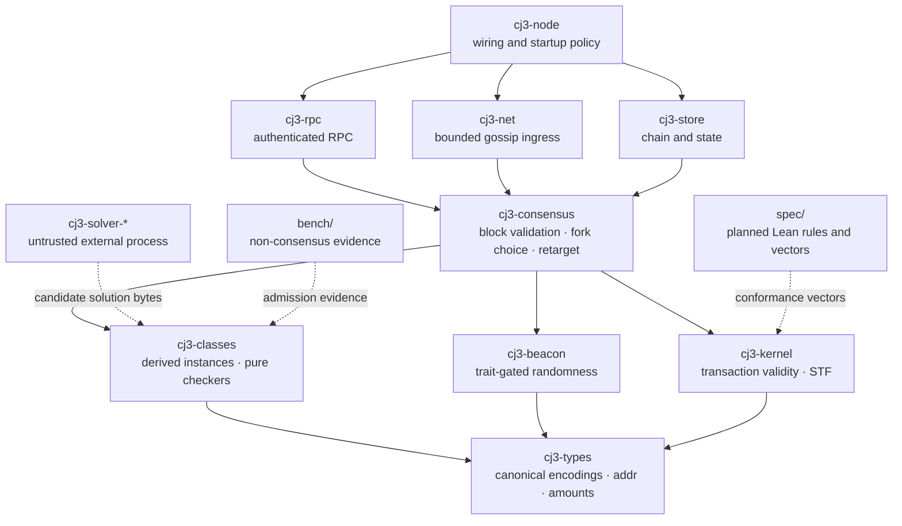

# COINjecture 3.0

[](https://github.com/Quigles1337/COINjecture3.0/actions/workflows/ci.yml)

COINjecture 3.0 specifies a derive-don't-trust redesign of proof-of-useful-work
consensus: validators derive the consensus quantities they use instead of accepting
miner-reported substitutes ([Engineering Plan A1–A4](docs/ENGINEERING_PLAN.md#1-axioms-binding-on-every-packet-violations-are-criticals),
[Protocol Spec §§5–11](docs/PROTOCOL_SPEC.md#5-problem-classes)).

The COINjecture 2.0 C1/C2 failure class is intended to be structurally
unrepresentable at the governing interface: the protocol derives the instance from
committed chain data, `check(instance, solution)` derives integer `Quality` without a
clock or miner metadata, and fork choice excludes quality. The first two boundaries
exist in the P-003 Rust trait and SIS prototype; Phase 2 block validation and fork
choice remain planned, so this is not a claim that a consensus implementation already
enforces the complete design ([audit mapping](docs/AUDIT_TRACEABILITY.md#1-finding-class-matrix),
[`ProblemClass`](crates/cj3-classes/src/lib.rs),
[phase plan](docs/ENGINEERING_PLAN.md#4-phase-plan)).

## Status

> Refreshed 2026-08-16 for the partial Gate G0 ruling. This is the repository's single current-status
> block; its refresh is required at every gate closeout
> ([standing rule](loop/LEDGER.md#standing-readme-drift-control-rule--ratified-al-2026-08-16)).
>
> | Field | Current record | Evidence |
> |---|---|---|
> | Scope | Private repository; pre-testnet; no running testnet, production node, or mainnet configuration | [D9/D12 rulings](loop/LEDGER.md#effective-ratifications), [source-policy gate](scripts/ci/check-source-policy.ps1) |
> | Phase | **Phase 0 — Gate G0 HOLD** | [phase plan](docs/ENGINEERING_PLAN.md#4-phase-plan), [packet queue](loop/PACKETS.md) |
> | Last phase gate | None of G0–G4 has passed; G0-A is ratified but G0 remains HOLD | [G0-A ruling](loop/LEDGER.md#gate-g0-partial-ruling-overlay--g0-a-ratified--g0-hold-al-2026-08-16), [queue state](loop/PACKETS.md) |
> | Completed packet evidence | P-001 through P-006, P-009, and P-010 are merged with exact-mainline CI records; P-005's Lean V1–V9/STF is HUMAN-RATIFIED | [batch log](loop/reports/BATCH-LOG.md), [G0 handoff](loop/reports/C7-phase0-g0-handoff.md) |
> | Current stop | G0-A ratifies static `size_param`; G0-B through G0-E remain held, so P-007 and P-101 cannot advance | [G0-A ruling](loop/LEDGER.md#gate-g0-partial-ruling-overlay--g0-a-ratified--g0-hold-al-2026-08-16), [draft P-007 PR #14](https://github.com/Quigles1337/COINjecture3.0/pull/14), [G0 handoff](loop/reports/C7-phase0-g0-handoff.md) |
> | Implemented surfaces | D6 CI and source policy; trait-gated beacon boundary; sampled-SIS derivation/checking and external demonstrator; admission and difficulty benches; HUMAN-ratified Lean V1–V9/STF; symbolic non-normative vectors; source-verified audit matrix v0.2 | [workflow](.github/workflows/ci.yml), [formal project](spec/README.md), [P-006 bench](bench/p006-difficulty/README.md), [audit matrix](docs/AUDIT_TRACEABILITY.md) |
> | Planned or absent | Canonical Rust codecs/domain bytes and codec fuzzing; kernel, storage, consensus, networking, RPC, node behavior; production VDF; testnet | [P-007 stop](loop/PACKETS.md#p-007--cj3-types), [explicit phase deferrals](scripts/ci/check-phase-gate.ps1), [roadmap](docs/ENGINEERING_PLAN.md#4-phase-plan) |

## Contents

- [Provenance: the audit lineage](#provenance-the-audit-lineage)
- [Design axioms](#design-axioms)
- [Architecture](#architecture)
- [Governance](#governance)
- [Verification and evidence](#verification-and-evidence)
- [Repository map](#repository-map)
- [Quickstart](#quickstart)
- [Limitations and open assumptions](#limitations-and-open-assumptions)
- [Roadmap](#roadmap)
- [License](#license)

## Provenance: the audit lineage

COINjecture 2.0's README presented a work-score formula containing self-reported
`solve_time` as a security mechanism; the third-party audit's C2 finding showed that
the same miner-controlled values affected fork choice and rewards. The CJ3 traceability
matrix retains that failure beside C1's miner-authored instance and the apply-path
findings rather than replacing them with a clean-slate narrative
([C1–C7 matrix](docs/AUDIT_TRACEABILITY.md#1-finding-class-matrix),
[preserved source manifest](loop/evidence/P-009-SOURCE-MANIFEST.md)).

The response is structural, not testimonial. The specified submission/checking path
has no timing or reported-score input, the instance is re-derived, and the specified
fork weight uses only a validated hash target; the source-policy gate also rejects the
known identifier family in every `cj3-*` Rust source file
([Protocol Spec §5.1](docs/PROTOCOL_SPEC.md#51-the-trait-contract-the-heart-of-a1a3),
[Protocol Spec §10](docs/PROTOCOL_SPEC.md#10-fork-choice-and-difficulty),
[source-policy script](scripts/ci/check-source-policy.ps1)).

That record has a deliberate limit: P-009 reconciled all 33 third-party findings and
all 25 Lean claim-points against the preserved sources, but the original Codex scan
file remains absent. The exact missing report inventory is therefore UNKNOWN even
though committed 2.0 remediation pointers preserve the known five program families
and two finding IDs
([matrix epistemic status](docs/AUDIT_TRACEABILITY.md),
[P-009 report](loop/reports/C7-p009-builder.md)).

## Design axioms

The following are ratified requirements, not assertions that all implementation phases
exist ([D3 and effective rulings](loop/LEDGER.md#effective-ratifications)).

| Axiom | Condensed requirement | Primary evidence or specification |
|---|---|---|
| A1 — Derive, don't read | A consensus value must be reproducible from committed data or be excluded. | [Plan A1](docs/ENGINEERING_PLAN.md#1-axioms-binding-on-every-packet-violations-are-criticals), [block rules B3–B12](docs/PROTOCOL_SPEC.md#62-block-validity-rules-b-rules-all-must-hold-typed-errors-never-panics) |
| A2 — Protocol-generated instances | Miners do not author or parameterize the instance used for validation. | [Plan A2](docs/ENGINEERING_PLAN.md#1-axioms-binding-on-every-packet-violations-are-criticals), [B5–B6](docs/PROTOCOL_SPEC.md#62-block-validity-rules-b-rules-all-must-hold-typed-errors-never-panics) |
| A3 — Pure scoring | Quality is an integer result of `(instance, solution)` with no timing or miner metadata. | [`ProblemClass` source](crates/cj3-classes/src/lib.rs), [Spec §5.1](docs/PROTOCOL_SPEC.md#51-the-trait-contract-the-heart-of-a1a3) |
| A4 — Decoupled fork choice | Quality gates validity and may shape rewards; it does not weight chain selection. | [Spec §10](docs/PROTOCOL_SPEC.md#10-fork-choice-and-difficulty) |
| A5 — Integer money | Require unsigned checked arithmetic and a conservation invariant on amount paths. | [Plan A5/D7](docs/ENGINEERING_PLAN.md#1-axioms-binding-on-every-packet-violations-are-criticals), [planned STF](docs/PROTOCOL_SPEC.md#8-state-and-the-state-transition-function-stf) |
| A6 — Apply trusts nothing | Require mutation to revalidate nonce, signer/address binding, balances, and atomicity. | [V-rules](docs/PROTOCOL_SPEC.md#7-transactions), [planned STF](docs/PROTOCOL_SPEC.md#8-state-and-the-state-transition-function-stf) |
| A7 — Fail closed | Require authenticated mutation, startup refusal on empty secrets, and typed malformed-input errors. | [Plan A7](docs/ENGINEERING_PLAN.md#1-axioms-binding-on-every-packet-violations-are-criticals), [planned Phase 3 rules](docs/PROTOCOL_SPEC.md#12-networking-and-rpc--baseline-requirements-normative-for-phase-3) |
| A8 — Spec before state-machine code | Require Lean transaction/STF semantics before Rust kernel conformance. | [Plan D5](docs/ENGINEERING_PLAN.md#3-decision-log), [current formal boundary](spec/README.md) |
| A9 — Minimal trusted base | Keep consensus crates in safe Rust and heavy solvers external and untrusted. | [workspace lint](Cargo.toml), [zero-unsafe gate](scripts/ci/verify-geiger.ps1), [solver boundary](crates/cj3-solver-sis/src/main.rs) |
| A10 — Honest claims | Label hardness as an assumption and retain PoUW's usefulness ceiling. | [open hardness wording issue](loop/reports/SPEC-ISSUES.md#si-001--sis-reduction-described-as-unconditional-proof), [survey caveats](docs/RESEARCH_SURVEY.md#caveats-and-honest-disagreements-in-the-literature) |
| A11 — Evidence or it did not happen | Require a run, artifact, or committed report for verification statements. | [batch log](loop/reports/BATCH-LOG.md), [autonomy protocol](loop/PROMPTS/AUTONOMOUS_BUILDER.md) |

## Architecture

This is the governed crate map, adapted from
[Engineering Plan §2](docs/ENGINEERING_PLAN.md#2-architecture-overview); it describes
the intended trust boundaries, not a claim that the full runtime is implemented.



Solvers cross the boundary only through candidate output that a safe-Rust checker
validates; the node does not link the solver library under the governing architecture
([Plan trust boundary](docs/ENGINEERING_PLAN.md#2-architecture-overview),
[current demonstrator manifest](crates/cj3-solver-sis/Cargo.toml),
[current node manifest](crates/cj3-node/Cargo.toml)).

## Governance

Authority overlays and ratified decisions live in the [decision ledger](loop/LEDGER.md), while executable order and current custody live in the [packet queue](loop/PACKETS.md) and [loop state](loop/STATE.md).
Each approved packet follows FRAME, BUILD, VERIFY, ADVERSARY, MERGE, and CALIBRATE, then leaves a report and a one-line [batch record](loop/reports/BATCH-LOG.md) under the [autonomy doctrine](loop/PROMPTS/AUTONOMOUS_BUILDER.md).
D17 permits autonomous merge only while all AUTO conditions and the D11 capacity check hold; formal semantics, vector definitions, decision ratification, owned TBDs, tripwires, and phase gates stop for human authority ([D17 ruling](loop/LEDGER.md#live-autonomy-ruling-overlay--ratified-al-2026-08-15), [G0–G4 gates](docs/ENGINEERING_PLAN.md#4-phase-plan)).

## Verification and evidence

A reader can audit a claim through four layers:

1. **Hosted execution.** The [D6 workflow](.github/workflows/ci.yml) defines
   formatting, Clippy, dependency policy/audit, zero-unsafe checks, tests, four named
   phase jobs, and a locked build; immutable packet and mainline URLs are recorded in
   the [batch log](loop/reports/BATCH-LOG.md).
2. **Deferral inspection.** A green phase job is not automatically proof that its
   future test ran: absent handlers emit `NOT_YET_ADMITTED` with an owner through
   [`check-phase-gate.ps1`](scripts/ci/check-phase-gate.ps1). Lean conformance,
   conservation, codec fuzz smoke, and the genesis spend test are currently in that
   explicit deferral state ([P-005 stop evidence](https://github.com/Quigles1337/COINjecture3.0/pull/9)).
3. **Packet evidence.** P-003 preserves the pinned estimator model, environment,
   solver observations, and checker observations under
   [`bench/p003-sis/`](bench/p003-sis/README.md); the packet report labels P-3/P-4 as
   provisional rather than ratified ([P-003 report](loop/reports/C3-p003-builder.md)).
4. **Negative evidence.** P-004 preserves raw and rendered legacy-class results;
   SubsetSum, SAT, and TSP were rejected, three descriptor-only classes remained
   insufficient evidence, and no class was admitted
   ([calibration report](bench/p004-admission/evidence/LEGACY-CALIBRATION.md),
   [raw JSONL](bench/p004-admission/evidence/legacy-results.jsonl)).

When checking any result, use the exact SHA and CI URL from the packet report rather
than assuming the current branch reproduces an earlier observation
([A11 procedure](loop/PROMPTS/AUTONOMOUS_BUILDER.md)).

## Repository map

| Path | Current role | Depth pointer |
|---|---|---|
| `crates/` | Rust workspace boundaries; P-002/P-003 contain the current protocol-adjacent spike code | [crate sources](crates/), [workspace manifest](Cargo.toml) |
| `bench/p003-sis/` | Reproducible estimator, solver, and verifier records for provisional SIS candidates | [bench guide](bench/p003-sis/README.md) |
| `bench/p004-admission/` | Bounded admission controller and read-only legacy calibration evidence | [bench guide](bench/p004-admission/README.md) |
| `spec/` | Reserved HUMAN-lane Lean/vector boundary; no formal rule or vector is defined | [boundary statement](spec/README.md) |
| `docs/` | Governing plan, draft protocol, audit traceability, and research caveats | [Engineering Plan](docs/ENGINEERING_PLAN.md), [Protocol Spec](docs/PROTOCOL_SPEC.md), [audit matrix](docs/AUDIT_TRACEABILITY.md), [research survey](docs/RESEARCH_SURVEY.md) |
| `loop/` | Decisions, queue, state, prompts, reports, and durable audit-source custody | [ledger](loop/LEDGER.md), [queue](loop/PACKETS.md), [reports](loop/reports/) |
| `scripts/ci/` | Source policy, zero-unsafe enforcement, and fail-explicit phase dispatch | [source policy](scripts/ci/check-source-policy.ps1), [phase dispatcher](scripts/ci/check-phase-gate.ps1) |
| `.github/` | D6/nightly workflows, PR evidence template, and the documented branch-protection contract | [D6 workflow](.github/workflows/ci.yml), [branch-protection contract](.github/BRANCH_PROTECTION.md) |

## Quickstart

From the repository root, the following commands check and build the workspace that
exists today; they do not start a node or a network
([P-010 command evidence](loop/reports/C6-p010-builder.md#3-verify),
[pinned toolchain](rust-toolchain.toml), [workspace members](Cargo.toml)).

```powershell
rustup show active-toolchain
cargo fmt --all -- --check
pwsh -NoProfile -File scripts/ci/check-source-policy.ps1
cargo test --workspace --all-targets --all-features --locked
cargo build --workspace --all-targets --all-features --locked
```

The full dependency and unsafe-code toolchain is defined by the hosted workflow; use
its immutable run rather than treating an unpinned local installation as equivalent
([D6 workflow](.github/workflows/ci.yml), [recorded runs](loop/reports/BATCH-LOG.md)).

## Limitations and open assumptions

- The ≤1/2 usefulness ceiling is an Ofelimos prior-art result, not a measured CJ3
  efficiency figure, and the survey finds no problem class with provably high
  usefulness ([research survey Area 5](docs/RESEARCH_SURVEY.md#area-5--consensus-skeleton-options),
  [survey caveats](docs/RESEARCH_SURVEY.md#caveats-and-honest-disagreements-in-the-literature)).
- SIS has a conditional worst-case-to-average-case reduction under stated asymptotic
  conditions; concrete parameter hardness and runtime remain assumptions supported by
  models and measurements, not unconditional or per-instance proofs
  ([SI-001](loop/reports/SPEC-ISSUES.md#si-001--sis-reduction-described-as-unconditional-proof),
  [P-003 evidence](loop/reports/C3-p003-builder.md)).
- The selected production beacon construction has no admitted implementation or
  security/timing parameter set; the present iterated-hash implementation is explicitly
  devnet-only and compile-rejected for testnet-tagged builds
  ([P-002 report](loop/reports/C2-p002-builder.md),
  [beacon source](crates/cj3-beacon/src/lib.rs)).
- The Lean V1–V9/STF encoding is HUMAN-RATIFIED and proves conservation under
  `LawfulStateOps`; its JSON vectors remain symbolic and non-normative pending
  SI-001/SI-002/SI-003, and no Rust kernel conformance claim exists yet
  ([formal boundary](spec/README.md), [P-005 merge](https://github.com/Quigles1337/COINjecture3.0/pull/9)).
- P-004 measured fixture behavior but admitted no legacy class; checker speed does not
  establish a hard sampled distribution
  ([P-004 report](loop/reports/C4-p004-builder.md),
  [calibration evidence](bench/p004-admission/evidence/LEGACY-CALIBRATION.md)).
- CJ3's useful-work difficulty is **governance-calibrated, not self-calibrating**.
  G0-A makes `size_param` a static protocol constant changed only by explicit human-
  ratified upgrade; every phase gate re-reviews its adequacy. An instance that becomes
  too easy loses usefulness, even though D2's eligibility/quality decoupling prevents
  that quality drift from directly weighting fork choice. P-006 also showed that
  checker-honest published quality can remain selection-biased: modeled equilibrium
  size retention was `0.423–0.806` at 35% strategic share and `0.240–0.700` at 51%
  ([G0-A amendment](loop/LEDGER.md#effective-g0-a-amendment-to-d2),
  [P-006 result](loop/reports/C7-p006-builder.md#candidate-findings)).

Material unfilled values remain visible:

| Item | State and owner | Evidence |
|---|---|---|
| P-1 — hash-target cadence only | **UNFILLED; no builder proposal** — P-006's normalized interval cannot justify an absolute cadence | [G0-A follow-up](loop/LEDGER.md#g0-a-integration-and-p-2-provisional-ratification-overlay-al-2026-08-16), [Spec §3](docs/PROTOCOL_SPEC.md#3-protocol-parameters) |
| P-2 — hash-target controller | **RATIFIED AS PROVISIONAL** — `W=32`, gain `1/8`, clamp `[8/9,9/8]`; conservative interior point, not a tuned optimum; re-derive when P-1 is ratified | [effective disposition](loop/LEDGER.md#effective-p-1p-2-disposition), [Spec §3](docs/PROTOCOL_SPEC.md#3-protocol-parameters) |
| P-11 — size-retarget window | **STRUCK — MOOT** — `size_param` is static and changed only by human-ratified protocol upgrade | [G0-A amendment](loop/LEDGER.md#effective-g0-a-amendment-to-d2), [Spec §10](docs/PROTOCOL_SPEC.md#10-fork-choice-and-difficulty) |
| P-3/P-4 — validation budget and SIS tuple | **TBD at the normative layer** — provisional P-003 recommendations; owner: G0/HUMAN ratification | [P-003 report](loop/reports/C3-p003-builder.md), [Spec §3](docs/PROTOCOL_SPEC.md#3-protocol-parameters) |
| P-7 — reward cap and reward curve | **TBD** — owner: Al + Sarah after the D16 reveal | [Spec §3](docs/PROTOCOL_SPEC.md#3-protocol-parameters), [D16 ratification](loop/LEDGER.md#effective-ratifications) |
| P-8/P-10 — ingress bounds and timestamp drift | **TBD** — owner: G0/HUMAN ratification | [Spec §3](docs/PROTOCOL_SPEC.md#3-protocol-parameters) |
| P-9 — minimum fee | **TBD** — owner: Al | [Spec §3](docs/PROTOCOL_SPEC.md#3-protocol-parameters) |
| P-12 — subsidy schedule | Placeholder only; owner: Al + Ken | [Spec §3](docs/PROTOCOL_SPEC.md#3-protocol-parameters) |
| Codec/domain bytes, strict Ed25519, SIS coefficient encoding, and SHAKE candidate convention | **UNFILLED** — owner: P-007/G0 HUMAN; draft PR #14 remains unmerged | [P-007 stop](loop/PACKETS.md#p-007--cj3-types), [SI-002/SI-003](loop/reports/SPEC-ISSUES.md) |
| Audit matrix v0.2 reconciliation | **COMPLETE** — 33 security findings, 25 Lean claims, R1–R8; GAP-7–13 remain proposals | [audit matrix](docs/AUDIT_TRACEABILITY.md), [P-009 report](loop/reports/C7-p009-builder.md) |

## Roadmap

The phase gates are evidence thresholds, not calendar or deployment promises
([full criteria](docs/ENGINEERING_PLAN.md#4-phase-plan)).

| Gate | Planned phase outcome | Current position |
|---|---|---|
| **G0 — Foundations and spikes** | P-001–P-007 reports complete; D1/D2/D14/D15 and open interpretation issues resolved with spike evidence | **▶ CURRENT — HOLD; G0-A static size is ratified, G0-B through G0-E await normative text** ([G0-A ruling](loop/LEDGER.md#gate-g0-partial-ruling-overlay--g0-a-ratified--g0-hold-al-2026-08-16), [G0 handoff](loop/reports/C7-phase0-g0-handoff.md)) |
| **G1 — Kernel** | Lean-vector conformance, conservation properties, mutation spot-check, genesis spend, and crash consistency | Planned after G0 ([Plan G1](docs/ENGINEERING_PLAN.md#4-phase-plan)) |
| **G2 — Consensus** | Deterministic two-node replay and typed rejection of the adversarial block corpus | Planned after G1 ([Plan G2](docs/ENGINEERING_PLAN.md#4-phase-plan)) |
| **G3 — Network and RPC** | Three-node devnet adversarial replay and complete fail-closed auth matrix | Planned after G2 ([Plan G3](docs/ENGINEERING_PLAN.md#4-phase-plan)) |
| **G4 — Testnet and integration seam** | Testnet operations, external solver fleet, adversarial replay, and stable frontend read/event surface | Planned after G3 ([Plan G4](docs/ENGINEERING_PLAN.md#4-phase-plan)) |

## License

License: TBD 
